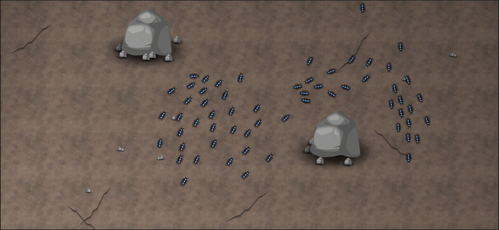

# Colony Wars

Colony Wars puts players in control of one of natures most fascinating creatures, Ants! Player's must collect resources to grow their ant population, build structures to access valuable locations, and clash with enemy ant factions in order for their colony to survive.

Featuring agent-based / emergent behavior, interactive environments, macro focused strategy, and massive scale (ironic?), there are plenty of stand out features to enjoy from Colony Wars.

Check out the Game Design Document on Nuclino for more detailed information - https://app.nuclino.com/BuggedOutGames/Colony-Wars

 

## Developer Setup

1. Install [Unity Hub](https://unity3d.com/get-unity/download)
2. Open Unity Hub and install Unity version 2019.4.13 
3. Create a Unity account (click profile icon in Unity Hub)
4. Create a personal license (click 'license' tab in Unity Hub)
5. Install Git if you haven't already, and also [Git LFS](https://git-lfs.github.com/)
6. Clone repository
7. Use Git LFS to fetch large image files
8. Install an IDE of your choice, such as [Rider](https://www.jetbrains.com/rider/)
9. Open cloned repository in Unity Hub

## Contribution Guidelines

Work on Colony Wars is organized using GitHub issues, pull requests, projects, and milestones.

All issues should have a relevant label (documentation, art, bug, code, etc.), 
be assigned to the "Colony Wars" project, and if applicable, be assigned a relevant milestone.

Issues that are in progress should be moved to the "In Progress" column in the "Colony Wars" project.

When writing commits, start each commit with the issue number, followed by a short description.

For example "Issue #123: Short description of commit here"

Finally, all work should only be merged in via code-reviewed pull requests, 
and after they are merged in the associated issue(s) should be closed out.

In summary, the workflow should look something like this 

1. Select an issue to work on (or create a new one), assign yourself to it, and move to in progress
2. Create a branch to do the work on, and name it "issue-x", where X is the issue number
3. Commit periodically, with each commit in the form "Issue #123: Short description of commit here"
4. Once work on the branch is complete, open a pull request and request reviewers.
5. Once the pull request has passed review, merge it into the main branch.
6. Close the associated issue out (if it wasn't done automatically)